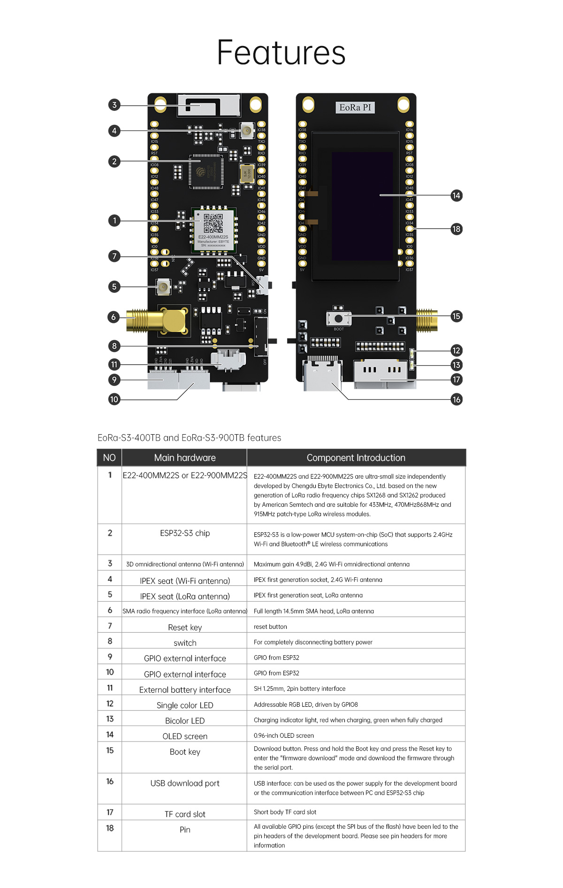
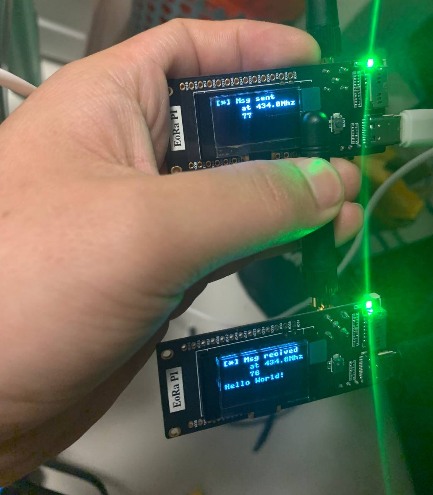

# esp32_lora_with_micropython

By Songhua Liu

## Hardware

| Type    | Specs |
| -------- | ------- |
| Board vendor  | Ebyte    |
| Board name | Eora PI     |
| Board version    | 1    |
| MCU | ESP32-S3FH4R2 (ESP32-S3 (4MB Flash 2MB PSRAM)) |
| RF chip | SX1268 |
| Onboard OLED display | SSD1306 (via I2C) |
| USB | 2.0 Type C| 
| PlatformIO support | Yes but not posted on PIO yet but [here's the board json file](./static/boards/EoRa_PI_V1.json) put it into 'boards' folder in pio projects, and set board **Eora_PI_V1**. PIO (>=6.5.0) supports [Adafruit QT Py ESP32-S3 (4MB Flash 2MB PSRAM)](https://www.adafruit.com/product/5700) which has the same MCU. You can select board **[adafruit_qtpy_esp32s3_n4r2](https://docs.platformio.org/en/latest/boards/espressif32/adafruit_qtpy_esp32s3_n4r2.html)** for bypassing compiling. PIO settings can be found from [here](https://docs.platformio.org/en/latest/boards/espressif32/adafruit_qtpy_esp32s3_n4r2.html). I did this with other firmware using IDF and Arduino framework. The support will be added one day.
| Arduino Support | Yes. Just select board **Adafruit QT Py ESP32-S3 (4MB Flash 2MB PSRAM)** because they have same MCU |
| ESP IDF Support | Yes. |

## Features



## Pins


## PCB diagram

Read PDF files from here for more IO defines

1. [Schematic](./static/pdf/EoRa+PI+Hardware+data/EoRa%20PI开发板原理图.pdf)
2. [PCB bottom layer map](./static/pdf/EoRa+PI+Hardware+data/EoRa%20PI开发板底层位号图.pdf)
3. [PCB upper layer map](./static/pdf/EoRa+PI+Hardware+data/EoRa%20PI开发板顶层位号图.pdf)

## Micropython setup

### 1. Install Thonny
Go <https://thonny.org>
### 2. Download customized firmware from micropython
Go <https://micropython.org/download/ESP32_GENERIC_S3/>, and find the **Firmware (4MiB flash)** for the MCU ESP32-S3FH4R2, download the bin file.

Or you can download my [firmware](./micropython_firmware_for_ESP32-S3FH4R2/ESP32_GENERIC_S3-FLASH_4M-20240516-v1.23.0-preview.379.gcfd5a8ea3.bin) in this repo. 

### 3. Flash firmware
Power on the board (hold boot button) and go to software Thonny,


#### **Notice**: 
Hold **boot** button on the board before power on the board for flashing. For some boards pre-flashed with compiling flags **-UARDUINO_USB_CDC_ON_BOOT -UARDUINO_USB_DFU_ON_BOOT -UARDUINO_USB_MSC_ON_BOOT**, you will not need to hold **boot** button for flashing.
### 4. Upload python scripts to the Chip
Delete the **boot.py** file on MicroPython Device in the left bottom corner.

On the left upper corner, find the folder **micropython_scripts**, right click on it and **Upload to /**

### 5. Test (Send and Receive)
After uploading all file to the chip, use a board as TX and another as RX.

On TX board, rename the file name "main_tx.py" to **main.py**

On RX board, rename the file name "main_rx.py" to **main.py**

Then power off and power on the boards via USB type c to your computer.

You can read from python console like this




## Suggestions for coding

From examples I wrote [here](./micropython_scripts/main_tx.py)

```python
sx.begin(freq=434.0, bw=125.0, sf=9, cr=7, syncWord=0x12, power=14, currentLimit=60.0,
         preambleLength=8, implicit=False, implicitLen=0xFF, crcOn=True, txIq=False, rxIq=False,
         tcxoVoltage=0, useRegulatorLDO=False, blocking=True)
```
For creating an connection object, by default the TCXO voltage is `tcxoVoltage=1.6`. I found the RF chip can't be drived. So I lowered it to 0 voltage. You may test as you need.

Happy hacking
